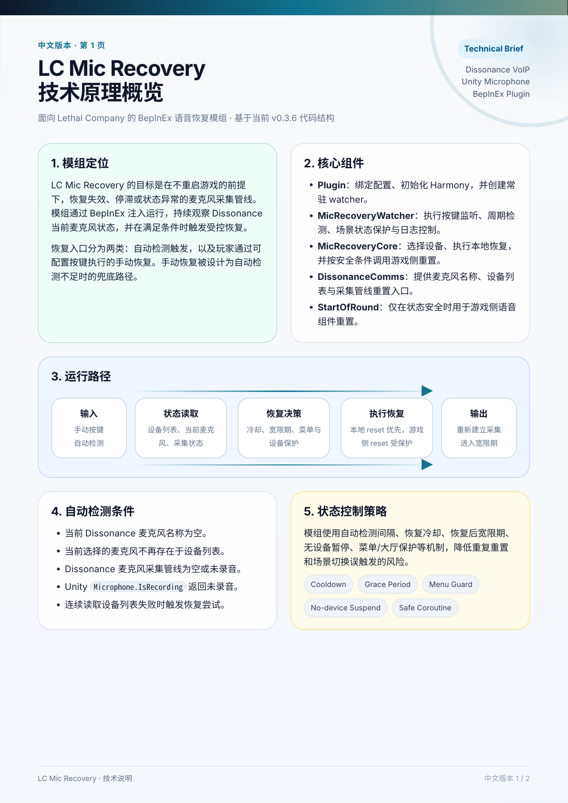
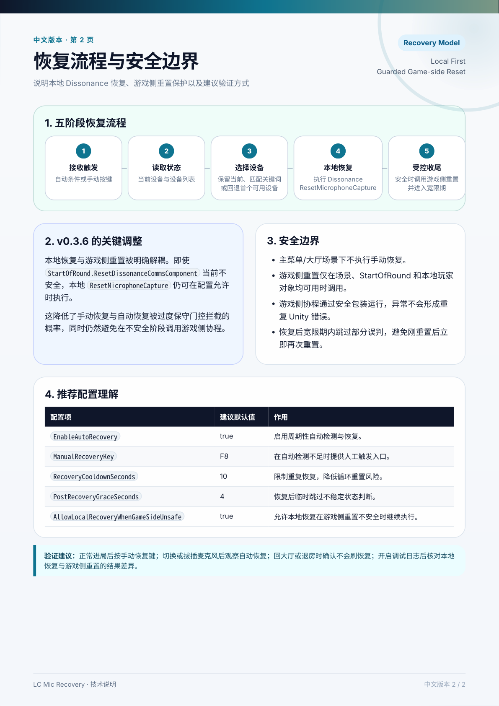
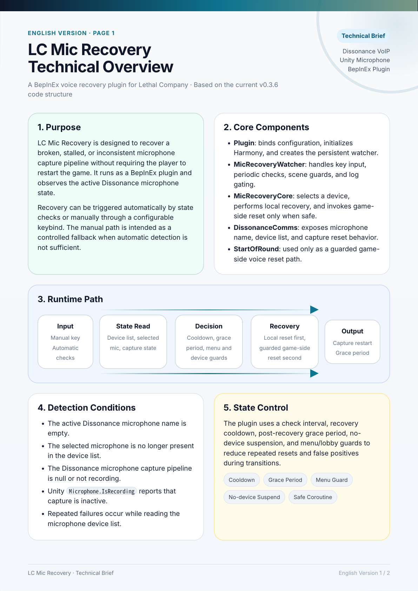
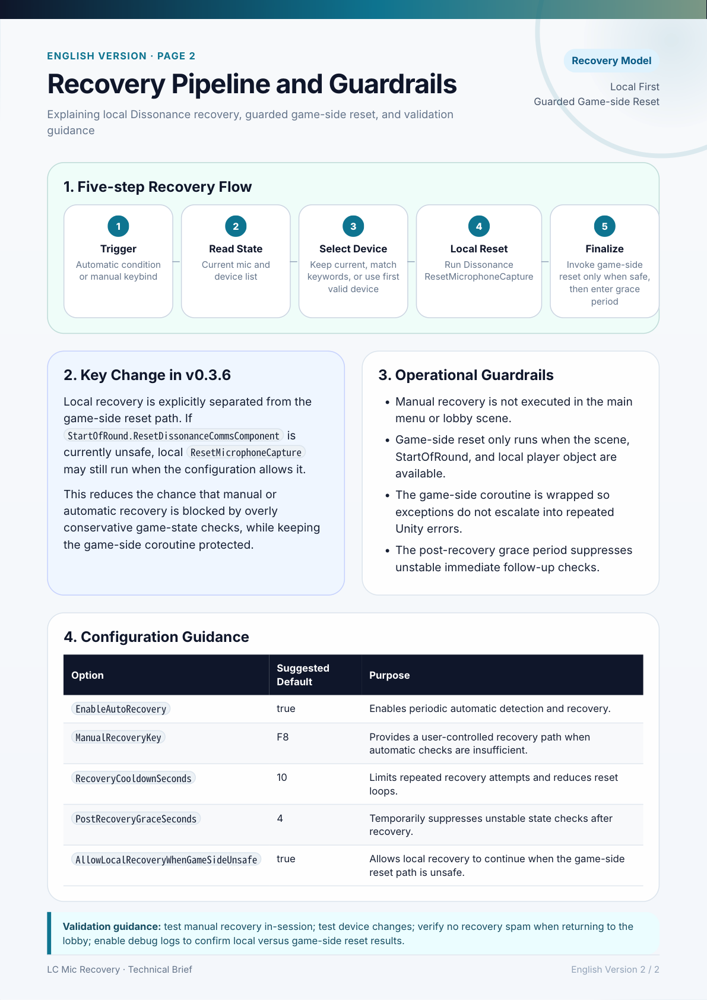

# LC Mic Recovery

LC Mic Recovery is a BepInEx plugin for Lethal Company that attempts to recover a stalled or broken microphone capture pipeline without requiring the player to restart the game.

The plugin is intentionally conservative. It prioritizes local Dissonance microphone recovery, keeps game-side reset calls guarded, and avoids recovery attempts during menu, lobby, teardown, and scene-transition states.

## Features

- Automatic microphone recovery when the active Dissonance microphone name is empty.
- Automatic recovery when the selected microphone is no longer present in the device list.
- Automatic recovery when Unity or Dissonance reports that microphone capture is not recording.
- Manual recovery keybind for cases where automatic detection is not sufficient.
- Local `ResetMicrophoneCapture()` recovery path as the primary recovery action.
- Guarded game-side `StartOfRound.ResetDissonanceCommsComponent()` support when the current game state is safe.
- Safe coroutine wrapper for the game-side reset path to avoid repeated Unity errors.
- Cooldown, post-recovery grace period, and failure backoff to reduce repeated reset spam.
- Menu, lobby, teardown, and scene-transition guards for safer recovery timing.
- Automatic Chinese/English user-facing text selection for logs and recovery notifications.

## Localization

`LanguageMode` controls user-facing language:

- `Auto` is the default. It uses Chinese only when LC-Chinese-Project / `V81TestChn` is detected; otherwise it uses English.
- `English` forces English logs and HUD notifications.
- `Chinese` forces Chinese logs. If Chinese HUD font support is not detected, in-game HUD notifications fall back to English to avoid square-box glyph rendering.

The in-game recovery notification is intentionally short so it fits the original Lethal Company HUD tip layout. Detailed recovery completion notes are written to the BepInEx log when five-step recovery logs, debug logs, or state logs are enabled.

## Project Principles

The following bilingual notes summarize the design principles used for LC Mic Recovery: conservative recovery, local-first reset behavior, and guarded game-side integration.

<details open>
<summary>View principles document</summary>

<p align="center">
  
</p>

<p align="center">
  
</p>

<p align="center">
  
</p>

<p align="center">
  
</p>

</details>

## Requirements

- Lethal Company V81-era game assemblies.
- BepInEx 5.
- Harmony / 0Harmony.
- DissonanceVoip, UnityEngine, Unity.InputSystem, Unity.Netcode.Runtime, and Assembly-CSharp references from the game installation.

The project currently references local game and r2modman profile paths in `LCMicRecovery/LCMicRecovery.csproj`. If your installation paths differ, update the `HintPath` values before building.

## Build

From the repository root:

```powershell
dotnet build .\LCMicRecovery\LCMicRecovery.csproj -c Release
```

The compiled plugin is emitted to `LCMicRecovery/bin/Release/LCMicRecovery.dll` unless the output path is overridden. Local build folders such as `bin`, `obj`, `tmpbin`, and `tmpobj` are intentionally ignored by git.

## Configuration

Configuration is managed through BepInEx config entries. Key options include:

- `EnableMod`
- `LanguageMode`
- `EnableAutoRecovery`
- `EnableManualRecoveryKey`
- `ManualRecoveryKey`
- `AutoCheckIntervalSeconds`
- `RecoveryCooldownSeconds`
- `PostRecoveryGraceSeconds`
- `SuspendAutoRecoveryWhenNoDevices`
- `SuspendAutoRecoveryDuringMenuOrTeardown`
- `AllowLocalRecoveryWhenGameSideUnsafe`
- `PreferredDeviceKeywords`

Default values are chosen for conservative behavior: automatic recovery is enabled, teardown/menu recovery is guarded, local recovery remains available when the game-side reset path is unsafe, and manual recovery is available as a fallback.

## Recovery Behavior

The recovery sequence first tries to keep the current microphone when it is still valid. If the current microphone is unavailable, it selects a preferred device by configured keyword, then falls back to the first valid device.

Local Dissonance reset is treated as the primary recovery mechanism. The game-side reset is executed only when the current game state appears safe. If the game-side reset is unavailable, already running, or unsafe, the plugin can still use local `ResetMicrophoneCapture()` when `AllowLocalRecoveryWhenGameSideUnsafe` is enabled.

## Repository Scope

The GitHub repository is kept minimal: source code, root documentation, license, project file, and required documentation images are tracked. Build outputs, local release staging directories, generated Thunderstore packages, and temporary artifacts are intentionally excluded.

## Notes

This project is intentionally small and targeted. Fixes should prefer local guards, clearer failure handling, and targeted compatibility checks over broad rewrites.
